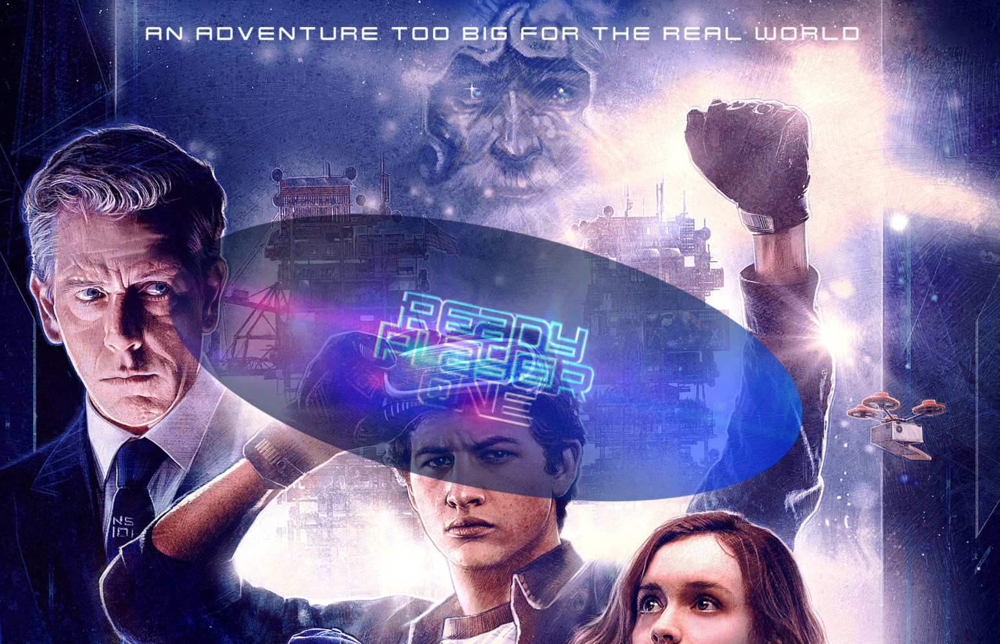
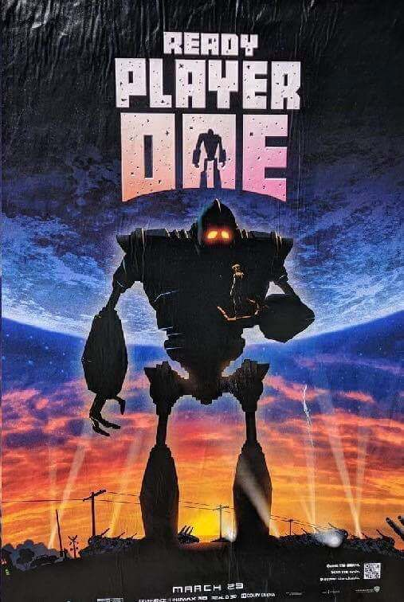

# My First Website

#### A simple promotion site for a movie.

## Description
Ready player one is an extremely stimulating visual masterpiece. This template was created as a simple 3 page website to promote a small project.

## Table of Contents
* [Technologies Used](#technologiesused)
* [Features](#features)
* [Design](#design)
* [Project Next Steps](#nextsteps)
* [Deployed App](#deployment)
* [About the Author](#author)

## Technologies Used
* JavaScript
* HTML5
* CSS3
* jQuery

## Features
* Users can view content through Parallax-styled web pages

## Whiteboard Images
### No major whiteboarding was done in the initial stages but the design was inspired by this movie poster.

## Trello Planning
* All planning in notebooks

## Design
* Design elements implemented using HTML5 and CSS3. 

## Project Next Steps
* Build mini examples for simple animations triggered by page actions

## Deployed Link
* Go live in live server to view
* Drag index.html file into browser to open

* You can view the repository:
[Github.com](https://github.com/Gr8ness21/moviePromo)
* If unable to view please go live locally through VS Code
    
## Works Cited:
* N/A

## About The Author
I build applications and mini projects tied to my various interests. I look for creative solutions to real world problems and think of technical ways to address them. While no application is ever perfect I find joy in the process and all my final products!

    
## Works Cited:
* N/A